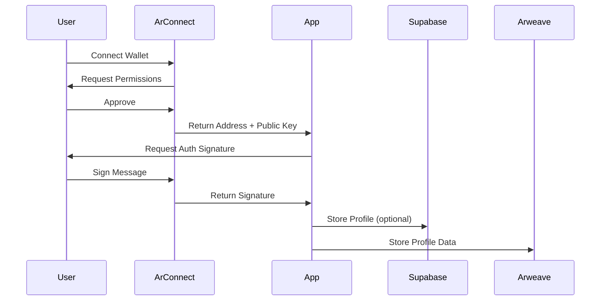

# Web3 Implementation Guide for Giza

## Overview

Giza now implements a true Web3-native authentication and data storage system that doesn't require a traditional backend server. Instead, it leverages:

1. **ArConnect Wallet** for authentication and signing
2. **Arweave Network** for permanent data storage
3. **Supabase** as an optional indexing layer
4. **STOAR SDK** for efficient batch uploads

## Architecture

### 1. Authentication Flow



### 2. Data Storage Options

#### Option A: Pure Arweave (Fully Decentralized)
```typescript
// Store directly on Arweave
import { uploadToArweave, queryArweaveData } from '@/lib/arweave-data';

// Upload contract
const txId = await uploadToArweave(contractData, DataType.CONTRACT);

// Query contracts
const contracts = await queryArweaveData(DataType.CONTRACT, walletAddress);
```

#### Option B: Hybrid (Arweave + Supabase Index)
```typescript
// Store on Arweave and index in Supabase
const txId = await uploadToArweave(contractData, DataType.CONTRACT);
await supabase.from('contracts').insert({
  arweave_tx_id: txId,
  // indexed fields for fast queries
});
```

## Implementation Details

### 1. Web3 Authentication Context

Replace the old `ArConnectContext` with the new `Web3AuthContext`:

```typescript
// In _app.tsx
import { Web3AuthProvider } from '@/contexts/Web3AuthContext';

function MyApp({ Component, pageProps }: AppProps) {
  return (
    <Web3AuthProvider>
      <Component {...pageProps} />
    </Web3AuthProvider>
  );
}
```

### 2. Requiring Wallet Signatures

Use the `useWalletSignature` hook for important actions:

```typescript
import { useWalletSignature } from '@/hooks/useWalletSignature';

function DocumentUpload() {
  const { executeSignedAction } = useWalletSignature();
  
  const handleUpload = async (file: File) => {
    const result = await executeSignedAction(
      async (signature) => {
        // Upload with signature
        return await uploadDocument(file, signature);
      },
      {
        actionType: 'upload',
        title: `Upload ${file.name}`,
        metadata: {
          fileSize: file.size,
          fileType: file.type
        }
      }
    );
  };
}
```

### 3. Storing Data on Arweave

```typescript
// Store contract
const contractTxId = await saveContractToArweave({
  id: contractId,
  name: contractName,
  content: contractContent,
  participants: [creatorAddress, recipientAddress],
  encrypted: true
});

// Store document
const documentTxId = await saveDocumentToArweave(
  documentBuffer,
  {
    name: 'contract.pdf',
    mimeType: 'application/pdf',
    contractId: contractId,
    encrypted: true
  }
);

// Store signature
const signatureTxId = await saveSignatureToArweave({
  documentId: documentTxId,
  contractId: contractId,
  signature: walletSignature,
  signerAddress: walletAddress,
  timestamp: Date.now()
});
```

### 4. Querying Data from Arweave

```typescript
// Get user's contracts
const contracts = await queryArweaveData(
  DataType.CONTRACT,
  walletAddress
);

// Get document signatures
const signatures = await getDocumentSignatures(documentId);

// Get specific transaction
const data = await getArweaveData(transactionId);
```

## No Backend Required!

This implementation works entirely client-side using:

1. **Arweave GraphQL** for querying data
2. **ArConnect** for wallet operations
3. **STOAR SDK** for efficient uploads
4. **Browser crypto** for encryption

## Cost Considerations

### Arweave Storage Costs
- One-time payment for permanent storage
- Current rate: ~$3-15 per GB (varies with AR price)
- Batch uploads with STOAR save 90% on costs

### Example Costs:
- Profile data: < $0.01
- Contract document (1MB): ~$0.01-0.02
- With STOAR batching: ~$0.001-0.002

## Security Best Practices

1. **Always verify signatures client-side**
   ```typescript
   const isValid = await verifySignature(message, signature, publicKey);
   ```

2. **Encrypt sensitive data before storing**
   ```typescript
   const encrypted = await encryptData(data, sharedKey);
   const txId = await uploadToArweave(encrypted, DataType.CONTRACT);
   ```

3. **Use nonces to prevent replay attacks**
   ```typescript
   const nonce = generateNonce();
   const message = `Action: ${action}\nNonce: ${nonce}\nTimestamp: ${Date.now()}`;
   ```

## Migration from Backend-Dependent to Web3-Native

### Step 1: Update Authentication
```bash
# Replace ArConnectContext with Web3AuthContext
mv src/contexts/ArConnectContext.tsx src/contexts/ArConnectContext.old.tsx
# Use the new Web3AuthContext.tsx
```

### Step 2: Update Data Storage
```typescript
// Old way (backend required)
const response = await fetch('/api/contracts', {
  method: 'POST',
  body: JSON.stringify(contractData)
});

// New way (Web3-native)
const txId = await saveContractToArweave(contractData);
```

### Step 3: Update Data Queries
```typescript
// Old way
const { data } = await supabase
  .from('contracts')
  .select('*')
  .eq('creator_id', userId);

// New way
const contracts = await queryArweaveData(
  DataType.CONTRACT,
  walletAddress
);
```

## Deployment Options

### 1. Static Hosting (Recommended)
Deploy as a static site on:
- **IPFS** - Fully decentralized
- **Arweave** - Permanent hosting
- **Vercel/Netlify** - Traditional CDN

### 2. Run Locally
```bash
cd client
npm run build
npm run export
# Serve the 'out' directory
```

### 3. Gateway Options
Instead of running your own backend, use:
- **arweave.net** - Official gateway
- **ar.io** - Decentralized gateway network
- **goldsky.com** - Arweave indexing service

## Advanced Features

### 1. AO (Arweave Computer) Integration
For complex logic without a backend:
```typescript
// Deploy process to AO
const processId = await deployAOProcess(contractLogic);

// Interact with process
const result = await sendMessage(processId, {
  action: 'validate-contract',
  data: contractData
});
```

### 2. Warp Contracts (SmartWeave)
For on-chain contract logic:
```typescript
import { WarpFactory } from 'warp-contracts';

const warp = WarpFactory.forMainnet();
const contract = warp.contract(contractId);
const state = await contract.readState();
```

### 3. Bundlr Network Integration
For optimized uploads:
```typescript
import Bundlr from '@bundlr-network/client';

const bundlr = new Bundlr('https://node1.bundlr.network', 'arweave');
await bundlr.ready();
const tx = await bundlr.upload(data, { tags });
```

## Monitoring and Analytics

### 1. ViewBlock Explorer
Monitor your transactions:
- https://viewblock.io/arweave

### 2. ArweaveSearch
Search your app's data:
- https://arweavesearch.com

### 3. SonAR
Analytics for your dApp:
- https://sonar.warp.cc

## Support and Resources

1. **ArConnect Documentation**: https://docs.arconnect.io
2. **Arweave Cookbook**: https://cookbook.arweave.dev
3. **STOAR SDK**: https://github.com/0xLPircy/stoar-sdk
4. **Community Discord**: https://discord.gg/arweave

## Example Implementation

See the updated files:
- `/client/src/contexts/Web3AuthContext.tsx` - Web3-native auth
- `/client/src/hooks/useWalletSignature.ts` - Signature management
- `/client/src/lib/arweave-data.ts` - Arweave data operations

This approach makes Giza a true dApp that can run anywhere without backend infrastructure!